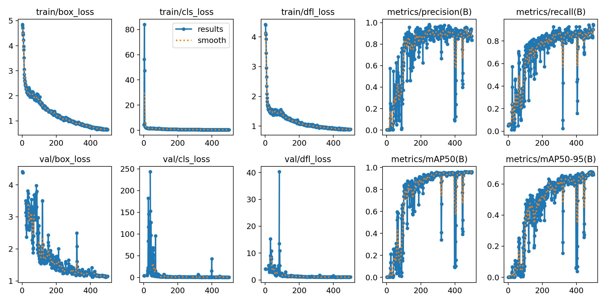

# Vehicle counting yolov8

## Project Overview
This project aims to automate counting vehicle that passes by. The class of this object detection is all vehicle from optimus prime to motorcyle


## Project Inspiration
I'm inspired to do this project because i saw news headline about Dishub(traffic police in indonesia) still counting vehicle manually at ramadhan event 2023


## Dataset

The dataset used for this project can be found [here](https://universe.roboflow.com/ikan-vzjcv/traffic-f8dmr). It consists of traffic picture with vehicle that already annotated. you can export the dataset with yolov8 yaml format.

## Installation
```
git clone https://github.com/ultralytics/yolov8
cd yolov8
pip install ultralytics==8.0.196
git clone https://github.com/ultralytics/ultralytics.git
```

## usage
```
python main.py
```

## Training Result
### yolov8m result



## Future Development
* some optimus prime is poorly detected and motorcyle is rarely get detected
* Need to clean the code ofc hehehehehehe ٩(◕‿◕｡)۶


